# SO4-Markets — Architecture Overview

This document describes the handler ↔ data_store interaction model for contributors with Rust experience but no prior Soroban or GMX background.

---

## 1. Contract Dependency Graph

```mermaid
graph TD
    User(["User / Keeper"])

    ExchangeRouter["exchange_router"]
    MarketFactory["market_factory"]
    DepositHandler["deposit_handler"]
    WithdrawalHandler["withdrawal_handler"]
    OrderHandler["order_handler"]
    LiquidationHandler["liquidation_handler"]
    ADLHandler["adl_handler"]
    FeeHandler["fee_handler"]
    Reader["reader"]

    DataStore[("data_store\n(single source of truth)")]
    RoleStore[("role_store\n(access control)")]
    Oracle["oracle\n(ephemeral prices)"]

    DepositVault["deposit_vault"]
    WithdrawalVault["withdrawal_vault"]
    OrderVault["order_vault"]
    MarketToken["market_token\n(LP token)"]
    ReferralStorage["referral_storage"]

    User -->|"multicall"| ExchangeRouter
    User -->|"create/cancel"| ExchangeRouter
    User -->|"keeper: set_prices + execute"| Oracle

    ExchangeRouter -->|"create/cancel/execute"| DepositHandler
    ExchangeRouter -->|"create/cancel/execute"| WithdrawalHandler
    ExchangeRouter -->|"create/update/cancel/execute"| OrderHandler

    DepositHandler -->|"CONTROLLER: read/write state"| DataStore
    DepositHandler -->|"has_role check"| RoleStore
    DepositHandler -->|"get_primary_price"| Oracle
    DepositHandler -->|"transfer tokens"| DepositVault
    DepositHandler -->|"mint/burn LP"| MarketToken

    WithdrawalHandler -->|"CONTROLLER: read/write state"| DataStore
    WithdrawalHandler -->|"has_role check"| RoleStore
    WithdrawalHandler -->|"get_primary_price"| Oracle
    WithdrawalHandler -->|"transfer tokens"| WithdrawalVault
    WithdrawalHandler -->|"burn LP"| MarketToken

    OrderHandler -->|"CONTROLLER: read/write state"| DataStore
    OrderHandler -->|"has_role check"| RoleStore
    OrderHandler -->|"get_primary_price"| Oracle
    OrderHandler -->|"hold collateral"| OrderVault

    LiquidationHandler -->|"CONTROLLER: read/write state"| DataStore
    LiquidationHandler -->|"has_role check"| RoleStore
    LiquidationHandler -->|"get_primary_price"| Oracle

    ADLHandler -->|"CONTROLLER: read/write state"| DataStore
    ADLHandler -->|"has_role check"| RoleStore
    ADLHandler -->|"get_primary_price"| Oracle

    FeeHandler -->|"CONTROLLER: read/write fees"| DataStore
    FeeHandler -->|"has_role check"| RoleStore

    Reader -->|"read-only"| DataStore

    MarketFactory -->|"CONTROLLER: register market"| DataStore
    MarketFactory -->|"has_role check"| RoleStore
    MarketFactory -->|"deploy"| MarketToken

    Oracle -->|"keeper keys"| DataStore
```



**Call direction:** `User → ExchangeRouter → Handler → DataStore / Oracle / Vault`

---

## 2. Why `data_store` Is the Single Source of Truth

All market state lives in one contract: `data_store`.

| State category | Examples |
|---|---|
| Open interest | `open_interest_key`, `open_interest_in_tokens_key` |
| Pool amounts | `pool_amount_key`, `swap_impact_pool_amount_key` |
| Funding state | `saved_funding_factor_per_second_key`, `funding_amount_per_size_key` |
| Borrowing state | `cumulative_borrowing_factor_key` |
| Positions | position entries keyed by account + market + collateral + direction |
| Orders & deposits | pending order/deposit/withdrawal props |
| Config | price impact factors, borrowing rates, funding bounds, keeper public keys |

**Handlers are stateless executors.** A handler contract stores only its own admin address and the addresses of its peers (data_store, oracle, vault, etc.) in instance storage. All business state is read from and written back to data_store in the same transaction.

This separation means any handler can be upgraded to a new WASM hash without touching storage. After the upgrade the handler still reads the same keys from the same data_store, and positions opened before the upgrade are unaffected.

---

## 3. The CONTROLLER Role and Why It Matters

`data_store` enforces a write guard on every mutating function (`set_u128`, `set_i128`, `apply_delta_to_u128`, etc.). The guard checks that the `caller` argument holds the `CONTROLLER` role in `role_store`:

```
sha256("CONTROLLER") → 32-byte role ID stored in role_store
```

On every mutating call the handler passes itself (or an authorised address) as `caller`. `data_store` calls `role_store.has_role(caller, CONTROLLER)` and panics if the check fails.

**Why it matters:**

- Only contracts explicitly granted `CONTROLLER` can modify market state.
- A newly deployed handler has no permissions until the protocol admin calls `role_store.grant_role(admin, new_handler, CONTROLLER)`.
- A compromised or buggy contract that was never granted `CONTROLLER` cannot corrupt OI, pool amounts, or position data.

**Defined roles** (from `libs/keys/src/lib.rs`):

| Role constant | Who holds it |
|---|---|
| `ROLE_ADMIN` | Protocol deployer / governance multisig |
| `CONTROLLER` | All handler contracts, `market_factory` |
| `MARKET_KEEPER` | Keeper bots (create/execute markets) |
| `ORDER_KEEPER` | Keeper bots (execute orders) |
| `LIQUIDATION_KEEPER` | Keeper bots (liquidate positions) |
| `ADL_KEEPER` | Keeper bots (auto-deleverage) |

---

## 4. Ledger-Scoped Oracle Prices

The `oracle` contract stores prices in **temporary ledger storage** with a short TTL (~10 minutes at 5 s/ledger). The flow on every execution:

1. **Keeper calls `oracle.set_prices(prices)`** — submits a batch of `SignedPrice` structs. Each struct carries `(token, min_price, max_price, timestamp, ledger_seq, signature)`.
2. **oracle verifies the signature** against a registered keeper public key (stored in `data_store` under `keeper_public_key_prefix`).
3. **oracle checks freshness** — `ledger_seq` must be within `LEDGER_SEQ_WINDOW` (60 ledgers ≈ 5 minutes) of the current ledger, and `timestamp` must be within 300 seconds of `env.ledger().timestamp()`.
4. **Prices are written to temporary storage** — they expire automatically after `PRICE_TTL` ledgers (also ~10 minutes).
5. **Handler reads `oracle.get_primary_price(token)`** in the same or a nearby transaction.

**Why prices expire:**

Keepers cannot pre-compute a favourable execution price and hold it for later. Every execution call requires a fresh price attestation signed at a ledger sequence that is close to the current one. An attacker who somehow obtained a stale signed price bundle cannot use it to execute at a price that no longer reflects the market.

---

## 5. Upgradability Model

### Upgradeable contracts

The following contracts expose a `pub fn upgrade(env, new_wasm_hash)` entry point guarded by their local `admin` (stored in instance storage at initialisation):

| Contract | Upgrade auth |
|---|---|
| `exchange_router` | local admin |
| `deposit_handler` | local admin |
| `withdrawal_handler` | local admin |
| `order_handler` | local admin |
| `liquidation_handler` | local admin |
| `adl_handler` | local admin |
| `fee_handler` | local admin |
| `market_factory` | local admin |
| `oracle` | local admin |
| `reader` | local admin |
| `referral_storage` | local admin |

**What is preserved on upgrade:** Soroban's `update_current_contract_wasm` replaces only the WASM bytecode. Instance and persistent storage are unchanged, so all configuration and state written before the upgrade remains intact.

**What is reset on upgrade:** Nothing — the new WASM reads the same storage layout written by the old WASM. If a storage schema change is required, a migration function must be added to the new WASM and called once after upgrade.

### Immutable contracts

`data_store`, `role_store`, and `market_token` have no `upgrade` entry point. This is intentional:

- **`data_store`** — upgrading the state store would risk a storage layout mismatch. All protocol state is keyed by deterministic 32-byte hashes computed in `libs/keys`; a new data_store could not safely change those layouts without a coordinated migration.
- **`role_store`** — the access-control contract must be trusted unconditionally by every other contract. Making it upgradeable would give the admin the ability to silently rewrite role assignments.
- **`market_token`** — an LP token contract should not be upgradeable after deployment; token holders must be able to trust that the mint/burn logic is fixed.
